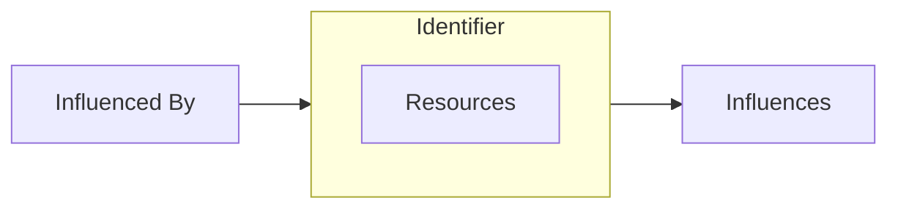
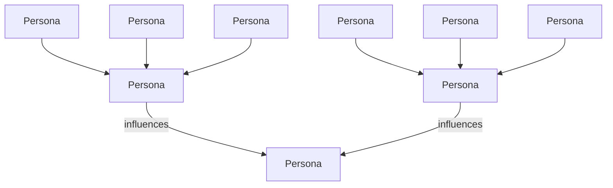
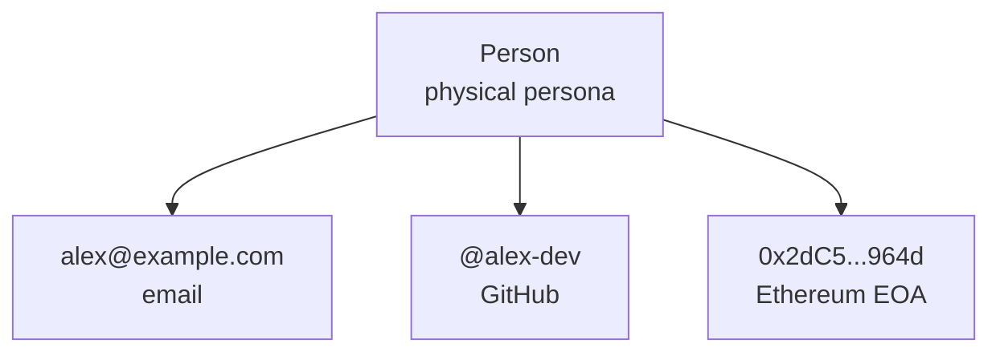

# Agency Graphs

*A design paper on composite identity, probabilistic trust, and the relationships that let communities act together.*

---

## About This Document

This document is a design paper developed at Sodal, Inc., between 2024 and 2026. It is released under the MIT License as an artifact of that period of work, not as an active specification. The business operations that supported its development are winding down. The ideas are being published here so that the framing, and the questions it opens, remain available for discussion.

The paper is a conceptual whitepaper, not a product pitch or standard. It introduces a way of thinking about identity, trust, and access in complex environments, grounded in composite identity and probabilistic agency rather than atomic identifiers and binary authorization. It develops the vocabulary, works through components, surveys use cases, and closes with an accounting of what was resolved and what was not.

I'd like to add three additional notes. First, the framing is the principal contribution: the claims about identity being composite, trust being probabilistic, and roles being emergent are core. Second, the specification-level details are deliberately sketched rather than finished; a production implementation would need more work, and the *What Remains Open* section at the end is candid about where. Third, the document uses the narrative thread of a wartime resistance network as a concrete anchor for abstract concepts. It is there to ground the ideas in how humans have long handled trust under adversarial conditions, not to romanticize that history.

*— Andy Schwab, 2026*

---

- [Mindset and Summary](#mindset-and-summary)
  - [Agency Graphs](#agency-graphs)
- [Concepts](#concepts)
  - [Composite Identity](#composite-identity)
  - [Implicit Roles](#implicit-roles)
  - [Dynamic Agency](#dynamic-agency)
  - [Behavioral Certainty](#behavioral-certainty)
- [Components](#components)
  - [Personas](#personas)
  - [Relationships](#relationships)
  - [Assertions](#assertions)
  - [Universal Persona Name](#universal-persona-name)
- [Example Use Cases](#example-use-cases)
  - [Collaborative Access Management](#collaborative-access-management)
  - [Community Member Lifecycle](#community-member-lifecycle)
  - [Reputation Management](#reputation-management)
  - [Artificial Intelligence Integration](#artificial-intelligence-integration)
  - [Open Verifiability Framework](#open-verifiability-framework)
  - [Improved Zero Trust](#improved-zero-trust)
  - [Open Source Supply Chain Verification](#open-source-supply-chain-verification)
  - [Self-sovereignty](#self-sovereignty)
  - [Collaboration Risk Reduction](#collaboration-risk-reduction)
  - [Systemic Resilience Public Goods](#systemic-resilience-public-goods)
- [What Remains Open](#what-remains-open)
  - [Gaps in the work](#gaps-in-the-work)
  - [Open development fronts](#open-development-fronts)

---

## Mindset and Summary

Communities are built on trust. The challenge in building trust is that we cannot be certain what other humans will do. This difficulty exists regardless of the technologies we employ; no technology can completely eliminate the risks associated with human trust building.

Humans have been wrestling with this challenge for a long time. To explain the principles at work, this paper will reference the historical experiences of a wartime resistance network in occupied Europe, one of many that moved hundreds of airmen and refugees out of danger over the course of a few years. It had no org chart, no central directory, no way to prove who anyone was. It was infiltrated repeatedly. Its members paid real costs. Yet it endured and delivered many to safety. It was able to do so because it had properties this document works to formalize: composite identity, implicit roles, dynamic agency, probabilistic trust.

The solution objective is to enable fast, effective decision making by reducing information barriers. This allows participants to *focus on trust decisions only humans can make*. The solution achieves this by programmatically generating clarity about the following:

1. **Identifiers**: how we refer to the agents we interact with
2. **Assertions**: what we know about the agents we interact with
3. **Agency**: what those agents can do with the resources in our environment
4. **Behavior**: what those agents are known to do with the capabilities they have
5. **Certainty**: our degree of confidence in assertions, agency, and behavior
6. **Insights**: where we can focus to quickly increase confidence in our environment
7. **Actions**: how we can use insights to increase speed and security in our community

### Agency Graphs

> **Agency Graphs** are probabilistic graphs of agency in digital systems

The core of our solution is a graph of linked identifiers in digital systems called an agency graph. Agency graphs enable shared resource management by clarifying and managing how influence flows through interconnected digital systems.

Agency graphs use *composite identities* called *personas* to model how participants influence the use of resources within digital systems. We refer to this influence as *agency*. Agency graphs model agency by describing the *relationships* between personas, illuminating when one persona can act on behalf of another persona. The result is a queryable graph of agency informed by every connected digital system.

Participants generate this graph to understand what resources they control, what resources others control, who they are interacting with, and who controls resources they depend on. Participants then use this knowledge to better allocate resources and improve access controls. Agency graphs build on information already available to participants, enabling participants to independently generate and use a graph to improve collaboration.

**A single persona:**

**A persona graph — personas linked by influence:**

---

## Concepts

Agency graph design incorporates four key concepts: composite identity, implicit roles, dynamic agency, and behavioral certainty.

### Composite Identity

> **Composite Identities** are identities that unite identifiers, capabilities, actions, and relationships

A stranger arriving at a resistance safehouse could not prove their identity in any single atomic way. A uniform could be faked, papers forged, an accent learned. Trust was established by composite: the uniform and the story of how the stranger came to be there, the details only a real member of their unit would know, and the word of the person in the previous village who had passed the stranger along. No single element was sufficient. Together, though, they create enough clarity for the resistance to take action.

Agency graphs assume identity to be a *composite* quality rather than an *atomic* quality. Agency graphs reveal identity through identifiers, capabilities, actions, and relationships. The result is a picture of agency as it cascades through systems.

Participants already use relationship data to improve their understanding of identity in other domains. Examples include running a background check, reviewing a *shared connections* list on a social network app, or analyzing a blockchain wallet's history of activity. An agency graph makes these relationships and related insights integral to the associated identity.

This composite aspect of identity exists in all volitional systems. By explicitly modeling the composite quality of identity, agency graphs expose how agency is already propagating through a participant's environment.

### Implicit Roles

> **Implicit Roles** are roles that emerge organically in a community

Resistance networks couldn't document and broadcast hierarchical org charts to manage teams. Doing so would have been fatal. Roles emerged from what people did and from who vouched for them. A farm was a safehouse because the farmer had space to hide travelers. A guide was a guide because she had expert knowledge of the crossing. A courier was a courier because others had trusted her with messages and those messages had not been compromised. These roles were legible to the network without being enumerated by a bureaucracy. Rather, they were defined by demonstrated capability and reputation established over time.

An agency graph combines elements of both a social network graph and systems identity management, acquiring properties of both. Like social network graphs, agency graphs model relationships between participants. Like systems identity managers, agency graphs also map access and resource rights information from integrated platforms. This produces a clearer picture of how people and resources are interrelated.

Participants use this picture to identify relationship structures, and then use those structures to understand *implicit* roles. Implicit roles are roles that emerge organically in a community. Once participants identify these roles, they can clarify and improve their composition. This is particularly useful when making trust decisions in the absence of a centralized decision-making authority or prescribed roles hierarchy.

This approach enables greater flexibility than traditional Identity and Access Management (IAM). In order to preserve the utility of an atomic identity, a traditional IAM tool must control every connected system so that it can bring those systems into conformity with the identity's role requirements. This kind of exhaustive, centralized control is incompatible with the goals and structure of many communities. Instead, by incorporating implicit roles, agency graphs enable simplified management while leaving community members free to independently deploy and manage disparate systems and tools. Implicit roles are what you get when explicit ones are too dangerous — or, in ordinary settings, too brittle — to maintain.

### Dynamic Agency

> **Dynamic Agency** describes how new data changes our understanding of influence

When a resistance network discovered it had been infiltrated, the question was never only about the person who had turned. It was about everyone that person had met, and everyone *those* people had introduced, and which safehouses were now compromised by association. The implications of the altered trust relationships had to be understood and managed faster than adversarial agents could conduct arrests and reprisals.

When a persona's relationships change, so does the persona's ability to access and influence resources in the environment. This quality cascades through downstream persona relationships, with access and permissions configurations informing the degree of impact from a single controller change on an entire set of personas. It is possible for a single modification in an upstream persona's configuration to alter the expected behavior and role suitability of all downstream personas.

Dynamic agency exists whether or not an identity system can model it. Agency graphs illuminate agency dependencies, enabling participants to better align resource access to the participant's risk tolerances. It makes clear, for instance, that participant environments can experience sudden, impactful swings in expected behavior if upstream personas have both low authorization minimums and high access levels.

### Behavioral Certainty

> **Behavioral Certainty** is a measure of our confidence in an agent's expected behavior

A resistance guide who had completed five crossings without incident was more trusted at the sixth than at the first. A volunteer vouched for by a known member started from a different baseline than one who had walked in off the street. The network could not achieve perfect certainty, but it could stack attestations, verifications, and observed behavior into a picture that was good enough to take meaningful action.

The expected behavior of a persona is influenced by many factors. Most of these factors are best described probabilistically: the odds that the user at the keyboard is acting as the expected agent assigned to the active account is never 1:1, but some lesser ratio that is impacted by circumstances ranging from emotional duress to credential compromise. Sometimes, our cats send emails. Rather than describing agent expected behavior in a binary way, it is both more accurate and more useful to describe expected agent behavior in a probabilistic way.

This insight is already employed in systems ranging from proof-of-stake blockchains to consumer credit scoring and actuarial functions. Agency graphs provide a way for participants to apply this class of insight. Describing behavior probabilistically enables participants to differentiate between *high-certainty* agency and *low-certainty* agency. By working to convert low-certainty personas into high-certainty personas, participants can increase collaboration speed and safety.

Participants can increase certainty in a variety of ways, including increasing authorization minimums, integrating provable attestations, use of verifiable credentials, obtaining confirmations from third party validators and oracles, real-time analysis of connections and endpoints, and incorporation of modular authorization mechanisms.

**System Assertion Scenario: Email Persona Behavior**

| Title | Declaration | Attestation | Verification | Certainty |
|---|:---:|:---:|:---:|---|
| Sender from domain with failed DMARC | - | | | strong negative signal |
| Sender from domain with no DMARC | | | | weak negative signal |
| Sender from domain with compliant DMARC | + | | | weak positive signal |
| DMARC compliant sender from known addresses list | + | + | | strong positive signal |
| DMARC compliant, known sender with GPG key | + | + | + | very strong positive signal |

In general, social personas will have inherently lower fidelity than system personas. System personas are declared by the instantiating platform (the personas' *source of being*). Canonical system persona declarations will have the same level of integrity as the platform. Social personas, however, must be asserted by graph operators, users, or external data sets (such as an HR database) and are subject to data staleness, inconsistency, interpretation, and error. Social persona fidelity is improved through third party attestations, cryptographic verifications, and other quantitative and qualitative mechanisms.

Participants model behavioral certainty to understand access patterns and collaboration risk across arbitrarily large shared resource environments. Participants can use this understanding to reduce risk by adding consensus-oriented control mechanisms to vulnerable portions of the graph. Even small changes in the right place can have a ripple effect that greatly increase expected behavior, and do so without the need for complex role enforcement or aggressive permissions reduction.

---

## Components

### Personas

A **persona** is how we describe agency in digital systems. A persona has three elements: an identifier, the resources the identifier directly controls or embodies, and a set of relationships with other personas.

**(1) an identifier**: a persona must have a locally unique identifier that allows us to reference it within a system.

- *Web1*: `alex@example.com` is a unique electronic mail address
- *Web2*: `@alex-dev` is a unique Github user handle
- *Web3*: `0x2dC58F417709323F34653Df24cA1f85bE09d964d` is the unique public key for an Ethereum externally owned account (EOA)
- *Physical*: a person has a recognizably unique, corporeal body in spacetime

**(2) the resources the identifier directly controls or embodies**: a persona is associated with the ability to initiate energy expenditure (to control or consume resources) in its instantiating system.

- *Web1*: The persona associated with `alex@example.com` can, through the domain email service provider, send and receive email messages on the public internet
- *Web2*: The persona associated with `@alex-dev` can, through Github's SaaS platform, employ a variety of compute and storage resources for the purpose of managing source code
- *Web3*: The persona associated with `0x2dC58F417709323F34653Df24cA1f85bE09d964d` can, through the Ethereum network, manage resources and exchange those resources for compute
- *Physical*: The persona associated with a person can, through their corporeal form, perform a variety of tasks including reading characters on a computer screen and typing on a keyboard

**(3) a set of relationships with other personas**: a persona is mapped to other personas showing dependent links between those personas. If a persona participates in the agency of another persona, we say it is a controller of that other persona.

The three elements of a persona allow us to map identity recursively as a *composite quality*. We build an increasingly complete understanding of a persona by exploring its controlling personas, the resources it directly controls, and what other personas it participates in.

The graph above maps a person's persona as the sole controller of each of the other example personas. The activities of the three digital personas are all part of what the person has been busy doing over time.

A **system persona** is a persona defined within and instantiated by a digital system. This definition is broad enough to encompass not only user accounts but groups, teams, channels, documents, repositories, smart contracts, and other capability sets within a digital system.

A **platform** is a *specific* digital system that instantiates and resources personas. Platforms bring actual system personas into being, and no system persona exists apart from an instantiating platform.

There are two system persona subtypes. An **authenticated persona** is directed by one or more credentialled external personas, and serves as the "bridge" between different platforms and platform domains. Conversely, an **internal persona** does not have its own credentials and is acted upon only by other personas in its own platform.

**Persona Types**

| Platform | Type | Subtype | Example Identifier |
|---|---|---|---|
| Email | Account | authenticated | `account@root.tld` |
| Discord | Account | authenticated | `#discordusername1234` |
| Google | Document | internal | `1gkHzjdr1tuMnwNm1fjfc9z8VycSktqTzaoazE2QuKU` |
| Github | Organization | internal | `example-project` |
| Slack | Channel | internal | `#team-channel-name` |

A **social persona** is an operator-defined persona that represents people and their relationships to other personas. Social personas attempt to map social and civic constructs within the agency graph: legal personhood, club membership, employment status, team composition, etc.

There are two types of social personas. A **participant persona** represents a human being. An **activity persona** represents a user-defined group of personas, and can include both social and system personas as its controllers.

A composable agency graph combines both social and system personas into a single relationship map. Graph operators use the combined map to create activity personas that incorporate social and system controllers, capturing implicit roles and defining composable collaboration structures. This allows participants to coordinate resources at scale without the need for pre-assigned roles, hierarchies, or other centralized, relational structures.

This is valuable for ad hoc teams that do not have a formal user directory. A Discord server's roles or GitHub organization's membership may function as the de facto source of truth for participation status. An agency graph captures these implicit roles by adding existing system personas as controllers within an aggregate activity persona. The graph operator can now use the activity persona's state to automate alerts or permission assignments across all connected platforms.

### Relationships

Personas form composite identities when operators relate them to other personas. There are two types of relationships in an agency graph: a **controller relationship**, and an **alias relationship**.

A controller relationship describes how personas exercise agency through other personas. A persona is considered a **controller** of an **agent** persona if the controller can access or employ the agent persona's resources, including the resources indirectly influenced by the agent persona through its own controllers.

There are two core properties associated with persona controllers: **access level** and **authorization minimum**. Access level is a controller relationship property that describes a controller's permissions when taking action on behalf of the agent persona. Authorization minimum is a persona property that describes how many controllers must confirm an action before it can take place.

The **authorization minimum** property provides a single attribute to describe a class of related access control mechanisms. These mechanisms all relate to *consensus*: using confirmation from one or more personas to increase confidence that a behavior is expected. Examples of these mechanisms include smart contract multisigning, GitHub branch protection, social media post approval pipelines, threshold cryptography configurations, etc.

Bringing a stranger into a resistance safehouse required more than one member's say-so. Moving someone across a border required coordinated handoffs between people who could each verify the previous step. The more sensitive the action, the more independent vouchings were required. This was not policy. It was what remained after the networks that had not operated this way were gone. Authorization minimums in any setting encode the same lesson: single points of trust are single points of failure.

**Authorization Minimum**

| Authmin | Meaning | Examples |
|---|---|---|
| **0** | No authentication enforced | Read access in a public chat channel; no-login tools like Pastebin |
| **1** | A single controller must confirm authentication or action | Username and password login; a typical group mailing list where any member can send as the group; a chat channel where every user can post messages |
| **2** | Consensus between two controllers is required for authentication or action | GitHub branch protection with a review requirement prior to merge |
| **N:M** | Consensus between N controllers is required for authentication or action | A multisignature smart contract configured with a 3 of 5 approval structure; a financial approval workflow requiring 3 levels of approval |

Note that agency graphs are not acyclical. It is perfectly possible, for instance, for `abc@example.com` to be a recovery email for the account associated with `xyz@example.com`, and for `xyz@example.com` to be a recovery email for the account associated with `abc@example.com`.

An **alias relationship** allows us to link two distinct personas together as representing the same set of resources and relationships. Many platforms maintain an internal string identifier to reference resources. This immutable string is in addition to the user-defined handle but refers to the same resource. By using system APIs to obtain this internal identifier and then relating user-defined handles as aliases, we can build a more robust and comprehensive graph.

Alias relationships also allow us to model compound platform dependencies. Google Workspace user accounts, for instance, generate associated email addresses linked to the Google persona. In these cases, Google is providing both its own proprietary services and Email platform services through the same agent. The alias relationship captures that these three personas all relate to the same agent, as well as the instantiation dependence the email personas have on the Google persona: when the primary persona ceases to be, the aliases — including the email personas — cease to be as well.

### Assertions

Assertions generate personas and relationships.

Relationships are informed by graph participants as well as graph operators. A participant asserts ownership or access to system accounts by verifying with the graph system that the participant was in control of a given account at a given time. This approach preserves the autonomy of participants in two ways. First, participants are not required to create new, centralized accounts in order to collaborate. Second, assertion activities are voluntary and participant-managed.

By linking multiple accounts to their participant persona, participants increase the fidelity and utility of the graph. Graph operators can incentivize this information sharing by enabling additional capabilities based on verified participant persona attributes.

### Universal Persona Name

The **Universal Persona Name (UPN)** standard describes how persona nodes are named in the graph. UPNs serve as global "primary keys" for all personas. The UPN standard allows independent graph operators to generate consistent, nonconflicting persona identifiers. UPNs also enable graph operators to produce, export, and share independently generated graphs. UPNs should be short, human-readable strings.

> ***The structure outlined here is experimental and subject to frequent change***

A UPN consists of four label components separated by colons. The label components are:

- **UPN**: all UPNs begin with the string `upn` to differentiate them from other string identifiers. It is always lowercase.
- **platform**: the *platform* is the globally unique instantiating system name. Platforms are most easily associated with the commercial activity that maintains the system. It is always lowercase.
- **type**: the *type* is a single-depth, human-friendly way to categorize identifiers within a platform. It is always lowercase.
- **identifier**: the identifier is the locally unique name for the persona. Depending on the platform, identifiers may include additional domain information to ensure the UPN is globally unique. If a system's local identifier is not case sensitive, it should always be lowercase.

**UPN Examples**

| Address Reference | Platform | Type | Identifier |
|---|---|---|---|
| `upn:email:account:alex@example.com` | Email | Account | `alex@example.com` |
| `upn:github:organization:example-project` | Github | Organization | `example-project` |
| `upn:github:team:devs@example-project` | Github | Team | `devs@example-project` |
| `upn:directory:participant:12345` | Directory | Participant | `12345` (an HR-linked identifier) |

---

## Example Use Cases

### Collaborative Access Management

Agency graphs provide a mechanism for robust access management and resource automation in decentralized communities. By decoupling system ownership, resource control, and dependency insights, agency graphs empower every participant to improve how community resources are managed.

Most communities today manage shared resources through a patchwork: a Discord server, a GitHub organization, a Google Drive, a Slack, a wiki, a few shared credentials in a password manager somewhere. Each tool has its own permission model, its own notion of membership, and its own admin. When someone joins, leaves, or changes roles, an administrator is supposed to reconcile all of this by hand. Usually they don't, because the work is tedious and the cost of not doing it is invisible - until it isn't.

An agency graph treats these disparate tools as what they are: platforms, each instantiating system personas, each contributing controllers to composite participant personas. When a new member joins, a contributor steps back, or an account gets compromised, agency graphs immediately illuminate the impact across connected platforms. Access decisions stop being per-platform and start being per-person, with the platforms acting as the surface where those decisions are realized.

### Community Member Lifecycle

Communities manage members through a lifecycle: recruiting, onboarding, role transitions, exits, and the occasional bad actor. Each stage introduces friction when identity is atomic. Admitting a new member means manually provisioning access across every platform; a role change means an audit; an exit means hoping no stale access was missed.

Agency graphs let membership state be inferred from relationships rather than enforced from a central directory. A recruit enters at a limited capability access that expands as attestations accumulate. Onboarding is the incremental addition of controller relationships. Role transitions are activity persona membership changes. Exits remove controllers without requiring an exhaustive platform-by-platform audit. And when a bad actor surfaces, the graph exposes every resource they can reach - including indirect agency through downstream personas - making containment exhaustive and fast. And by illuminating weak points in control flow, agency graphs enable operators to take actions that mitigate the risk of an account compromise before it happens.

### Reputation Management

Participant assertions enable individuals to create and share provable persona agency maps. Graph operators can use insights from these maps and existing agency graph data to establish and refine participant reputation and trust.

Conventional reputation systems have two recurring problems: they are siloed, so a reputation earned on one platform does not travel to another; and they are platform-owned, so the person the reputation describes has limited standing to correct, contest, or port it. The result is that participants invest in reputation that they don't fully control, on platforms that can change the rules or disappear entirely.

Agency graphs invert the arrangement. A participant's reputation is the sum of attestations attached to their participant persona: attestations they chose to attach, from controllers they recognize. Because the graph is generated rather than granted, reputation becomes something participants can port between contexts, present selectively, and build incrementally across platforms that would otherwise have no way to share it.

This approach does not neutralize the failure modes of reputation systems - gaming, collusion, and the encoding of existing bias as quantified trust. What it can do is make those failure modes inspectable. A reputation grounded in a graph shows its sources: who vouched, on what basis, with what stake. A participant evaluating someone else's reputation can trace it rather than accept it, and can weight attestations by their own priors about the attesters. This doesn't remove the need for human judgment. It does make the inputs to that judgment legible.

### Artificial Intelligence Integration

Agency graphs provide a mechanism to understand and mitigate the risks introduced by artificial intelligence capabilities. The probabilistic output of AI fits naturally into the probabilistic understanding of agency in an agency graph. By incorporating an AI node as simply another persona with dynamic agency, participants can model impact and tune configurations to maintain high net behavioral certainty — maximizing the value of AI while mitigating undesired effects.

An AI agent acting on behalf of a participant is, for agency graph purposes, a controller relationship like any other. The agent has its own identifier, controls some set of resources, and acts under some authorization minimum. Critically, it also has a behavioral certainty that is lower than a known human collaborator's in some dimensions and higher in others. It may be faster and more consistent at its core tasks, but less predictable at the edges of its training. Treating the agent as a persona rather than as a tool makes these properties explicit and configurable rather than implicit and assumed.

This framing gives participants practical controls. An AI persona with high access and a low authorization minimum is exactly the upstream configuration that dynamic agency warns about: a single compromise or prompt injection ripples downstream to every resource the agent can reach. Raising the authorization minimum for sensitive actions (requiring a human co-signer, or a second agent instance, or both) brings AI into the same consensus framework that applies to any other high-impact controller. The goal is not to refuse AI agency, but to place it in the graph where its effects can be reasoned about.

### Open Verifiability Framework

Integrating verifiable credentials (VCs) and other cryptographic proving mechanisms into personas can result in both greater behavioral certainty for participants and streamlined interoperability for VC providers.

VCs transition various identity attestations from a siloed, service-centric approach to an ecosystem approach that can give all stakeholders both greater security and flexibility. VCs are themselves atomic, however, and the added complexity of managing the interactions between stakeholders has resulted in high friction and low interoperability in practice.

Agency graphs provide a framework for VC integration that emphasizes their utility while mitigating their drawbacks. VCs can be overlayed on existing personas to increase certainty without requiring participants to migrate to greenfield, stand-alone VC solutions. In this context, VCs don't replace atomic identifiers but instead enhance composite identities.

A concrete case: a participant's GitHub account is already a system persona with its own controllers and behavioral signals. A VC attesting that the same participant holds a particular professional certification can be attached to that persona as an attestation — not replacing the GitHub identifier, not requiring a new account on a VC-native platform, just adding signal. A graph operator deciding whether to grant access to a sensitive repository can now weight both the GitHub activity history and the external credential, without either system needing to know about the other. The VC ecosystem gains a consumer; the participant avoids having to maintain parallel identity stacks.

### Improved Zero Trust

Agency graphs with certainty-based modeling give autonomous participants means to apply NIST 800-207 Zero Trust Framework concepts without centralized policies and controls. Graph operators select composite identity risk priorities based on an independent assessment of workflow criticality and resource sensitivity. Each participant has the freedom to identify what they can control, decide who has access within the context of that control, and select the level of risk they are willing to accept with regard to those resources.

This approach has resilience properties that are inaccessible to strict Zero Trust for this reason: Zero Trust is not actually *zero* trust. Zero Trust shifts trust from the internal enterprise network to the policy engine, assigned atomic identities, and various system dependencies. Each implicit trust anchor represents a risk that Zero Trust cannot directly mitigate.

- *Core Policy Engine*: Because Zero Trust depends on a central policy engine, it is possible for mismanagement or compromise of a single, core policy enforcement system to result in the collapse of the entire security apparatus.
- *System Dependencies*: The Solarwinds supply chain hack illuminated the degree to which centralized Zero Trust often moves liability around rather than addressing the core trust questions. Root certificates, third party integrations, SaaS vendors, and a variety of other dependencies are, once vetted, assumed to be trustworthy. Zero Trust may eliminate "trust and verify" with regard to user access control, but reintroduces it at the level of other (potentially more critical) dependencies.
- *Atomic Identity*: Recent and recurring disclosures of secret and sensitive US Government data illuminate the failure of binary agent behavior mapping in complex systems.
- *Employee & User Trust*: the same technologies that enable ubiquitous centralized control in support of Zero Trust frequently require that employees and users place complete and exhaustive trust in the centralized institution. This is disingenuous, as the risk profile that best protects the organization's board will frequently be at odds with the risk profile that users, employees, or customers consider acceptable.

A certainty-based agency graph approach turns increased community scale into increased resilience by enabling every participant to act as an independent, incentivized threat management node.

The resistance networks invoked earlier in this document did not choose decentralization as an architecture. They had no choice. A central policy engine, a directory, a complete membership list — any of these would have been fatal the moment it fell into the wrong hands. Survival required that no single person, document, or system hold the whole picture. The systems most resilient to compromise are those where the compromise of any single component does not cascade into collapse. Zero Trust moves the failure point rather than removing it. A graph-based approach distributes it, providing a more resilient foundation.

### Open Source Supply Chain Verification

Agency graphs provide a mechanism for participants that depend on third party open source software to independently create and maintain behavioral certainty and risk metrics for those dependencies.

Current mitigations — SBOMs, sigstore, provenance attestations — produce useful evidence atomically, without a framework for integrating that evidence into live operational decisions. An agency graph treats each dependency's maintainer set, build pipeline, and release infrastructure as controllers of the published package persona. A package released from a single-maintainer personal account with no branch protection has different behavioral certainty than one released through a multi-signature process with attested provenance. This makes supply chain risk explicit, queryable, and independently assessable by every downstream consumer, without requiring a centralized registry or vetting authority.

### Self-sovereignty

Agency graphs provide a mechanism to unify and bring greater value to existing efforts involving DIDs, Soulbound tokens, and self-sovereignty initiatives. These efforts have produced strong cryptographic primitives but have struggled to find purchase in day-to-day collaboration, partly because they operate at the level of atomic identifiers while real-world trust decisions are made against composite identities informed by relationships and context.

In an agency graph, a DID is not a replacement identity but a high-certainty controller edge. A Soulbound token is an attestation attached to a participant persona, contributing to behavioral certainty without requiring the ecosystem to migrate wholesale to a token-gated paradigm. Participants retain sovereignty over which artifacts they present and to whom; graph operators get a frame for applying those artifacts to live access and risk decisions.

### Collaboration Risk Reduction

Agency graphs show where uncertainty is concentrated in an environment. Increasing certainty has benefits for all stakeholders, and agency graphs can accommodate a variety of mechanisms to increase certainty. Simple mechanisms include programmatic assertions or verifiable credential linking. The concept can be extended further with more complex mechanisms including staking, escrow, and insurance-type control mechanisms.

Participants could, for instance, offset low or non-existent reputation with financial staking or insurance, allowing communities to rapidly incorporate new users and enable greater resource sharing while mitigating the cost of potential abuse. A new contributor with no prior reputation posts a bond against good behavior; the bond is released as behavioral certainty accumulates, or forfeited if abuse occurs. The community gains a way to extend trust quickly without relying on it absolutely, and the newcomer gains a way to demonstrate commitment that doesn't require already being known.

These kinds of mechanisms become newly practical once uncertainty is measurable. Without an agency graph, staking and insurance schemes face a framing problem: *stake against what*? A graph-based approach answers that question by locating the specific controllers, access levels, and authorization minimums that determine the risk being underwritten. This makes such mechanisms particularly valuable in high-privacy contexts, or settings where legal or reputational certainty mechanisms are unworkable or inadequate.

### Systemic Resilience Public Goods

Redundancy is a core aspect of resilience. It is possible, however, for complex systems to appear highly redundant when, in fact, the "redundant" components all share a single, common dependency. In highly decentralized systems, for instance, the value of decentralization may be directly undermined if the majority of participants are drawn to Schelling point infrastructure decisions.

Agency graphs surface these hidden concentrations. Tracing controllers of controllers exposes cases where nominally independent services resolve back to the same cloud provider, root certificate authority, DNS registrar, or upstream package maintainer. This visibility is itself a public good: it lets communities identify single points of failure that no individual participant could see from a local view, and it creates incentives to route around them. Over time, shared agency graph data becomes a map of concentration risk at the level of entire digital ecosystems — the kind of view that individual security audits and compliance frameworks are structurally unable to produce.

---

## What Remains Open

This document is a snapshot of a line of thinking, not a complete specification. Gaps and open development fronts are noted below.

### Gaps in the work

**Certainty is described, not computed.** The document argues that behavioral certainty is probabilistic and that it accumulates across declarations, attestations, and verifications. The DMARC table illustrates this qualitatively. It does not specify how certainty values would actually be computed, how they would compose across multiple controllers, or how a graph operator would choose weights. Practical experimentation with multiple algorithms across access control, recruiting, and community management use cases confirmed that the approach works in practice, but no unified computational approach was formalized.

**UPN is a sketch.** The Universal Persona Name structure is presented as experimental, and the document does not explore graph interoperability considerations. Collision handling, platform-name authority, the process for evolving the schema, and the case-sensitivity rules for edge cases are all undefined. To have broad utility, the UPN format assumes some level of coordination between independent graph operators that is not provided for here. A production implementation would need to address these challenges.

### Open development fronts

**Operator plurality is the design principle, not a specification gap.** Readers may notice that "graph operator" is used in different ways across the document: sometimes meaning every participant generating a view of their own environment, sometimes meaning an actor coordinating on behalf of a community. This is intentional. The claim agency graphs make is that *anyone can be a graph operator*, and that the graphs different operators generate are meant to coexist rather than reconcile into a single canonical view.

This matters because the problem agency graphs respond to is not the absence of reputation and access systems. It is the existence of very powerful ones, owned and operated by entities whose interests are often at odds with the people the systems describe. Surveillance infrastructure, platform-owned reputation, and centralized identity are already instruments of control, and users are "opted in" to them by default. Agency graphs are a concept that can be localized: a worker cooperative, a journalism network, a dissident community, or an ordinary business can generate its own graph over its own environment and act on the basis of something it controls rather than something granted to it.

That is a core principle, a move toward parity rather than toward new control. The open development work is figuring out how plural graphs compose when they need to, how minority views are preserved against dominant ones, how operators coordinate without collapsing into hierarchy, and how a community decides whose graph to rely on in which context. These are difficult questions, but we believe agency graphs provide an important framework to answer them in new ways.

**Threat modeling needs a native vocabulary.** The document does not present a conventional threat model, and the omission is deliberate. Conventional threat modeling assumes atomic identities, binary authorization, and a single authority defining what counts as legitimate behavior. Under those assumptions, threats can be enumerated cleanly — but the enumeration inherits the assumptions' blind spots. A threat model that treats "unauthorized access" as the primary threat cannot see that the authority defining authorization might itself be the adversary. A threat model that assumes a single definition of acceptable behavior cannot see that the definition encodes the biases of whoever wrote it. Any attempt to fit agency graphs into this vocabulary collapses the framework back into the assumptions it was built to escape.

What is needed is a threat-modeling approach native to probabilistic, composite, graph-based agency. The approach must treat authority as plural and contested, behavior as probabilistic rather than binary, and identity as something that accumulates rather than something that is assigned. This is open territory. It is also, in my view, the more interesting version of the question. The conventional vocabulary was built for systems that agency graphs are arguing against; developing the vocabulary for what comes after is part of the work, not a prerequisite to it.
